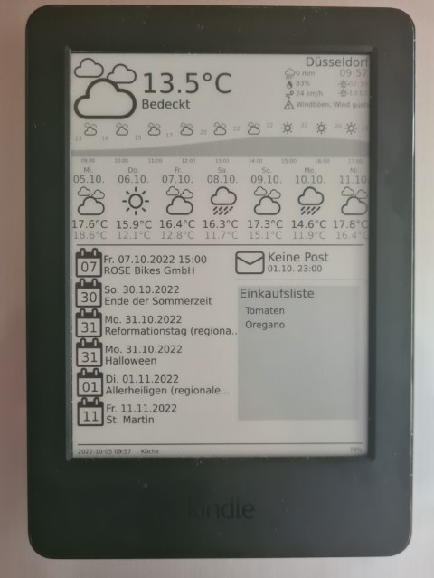

# kindledashboard
Transform your kindle into a weather station, calendar and smart home dashboard. Consists out of a dockerized server and a kindle shell script. 
Uses data from Openweather API, Google Calendar, Google Tasks and Home Assistant. 

Forked from [nicoh88/kindle-kt3_weatherdisplay_battery-optimized](nicoh88/kindle-kt3_weatherdisplay_battery-optimized)

## Features
* ⛅ Weather forecast for the next 6 days using Openweather API
* 📆 Google Calendar integration
* 📝 Google Tasks integration (e.g. for shopping list)
* 🏡 Home Assistant integration to display unread mail using a boolean movement sensor 
* 🔋 Long lasting battery (2-4 weeks, depending on battery condition)



## Supported devices
This implementation was tested with a Kindle of the 8th generation (KT3). Other Kindle models should work as well but were not tested. Make sure to adjust the screen resolution of the resulting png file to match your model.

## Disclaimer
No warranty or liability is given for any damage caused by this software. Perform any of the steps described here at your own risk.

# Prerequisites
## Server
1. A device in the network (such as raspberry pi) with a docker daemon installed which is accessible in the network.

## Kindle Client
1. A jailbroken Kindle of any generation. Instructions on jaibreaking your kindle are all over the internet, for example [here](https://www.epubor.com/how-to-jailbreak-kindle-paperwhite.html).
2. For setup of the shell script usbnet needs to be installed on the kindle. Instructions can be found [here](https://wiki.mobileread.com/wiki/USBNetwork).

# Installation
## Server
1. Ensure to update the variables in the following files:
   * `app.py` main application:
     * `payload.lat`: Your latitude
     * `payload.lon`: Your longitude
     * `payload.appid`: The api key for weather forecasts. You can generate it for free on openweathermap.org
     * `payload.lang`: The language you want to display
     * `CITY`: The city you want to display in the dashboard.
   * `/googlecalendar/` folder: Contains Google calendar integration
     * `credentials.json` Google Calendar credentials that can be generated in [your Google cloud console](https://console.cloud.google.com/apis/credentials). Choose the type web application and replace the values in `client_id`, `client_secret` and `refresh_token` with the generated values.
     * `controller.py` Replace the values in `CALENDERIDS` with the ids of the calendars you want to display.
   * `/notes/` Google task integration
     * `controller.py` Replace the values in `tasklistId` with the id of the tasklist you want to display.
     * `credentials.json` replace the values in `client_id`, `client_secret` and `refresh_token` with the values from your Google Cloud Console
   * `/mail/controller.py` Home Assistant integration (disabled by default as this is highly customised):
     * `HASSURL`: The REST endpoint of your smart home server
     * `HASSTOKEN`: Your Home Assistant refresh token 
     * `HASSVARISMAIL` & `HASSVARTIMESTAMP`: Custom variables to be displayed on the screen.
2. Navigate to the server folder and build the docker image:
```
docker build -t flask-kindledashboard .
```
3. Start the container. Replace `5123` with the port you weant to expose: 
```
docker run -p 5123:5000 --restart unless-stopped -d --name kindledashboard flask-kindledashboard 
```
4. Navigate to the server url and append port and `/kindledashboard` suffix (e.g. http://192.168.178.63:5123/kindledashboard). The png should be generated after several seconds. Once the kindle devices are set up you can review the client logs in the endpoint `/kindledashboard/logs`.

## Kindle Client
1. Adjust the dashboardscript variables with the values from your network. 
  * Set your server IP in the `SERVERIP` and your port in the `SERVERIPPORT`. 
  * The script is executed up to every 15 minutes. To change the frequency adjust the values in `F5INTWORKDAY` and `F5INTWEEKEND`. 
  * You can adjust further variables such as `HOSTNAME` to distinguish between several kindle devices in your network.
2. Save your changes and copy the content of the `kindle` folder on the kindle. You can use the standard kindle mass storage to do so. This implementation uses the folder `/mnt/us/scripts` as destination folder. The folder `/mnt/us` is the mass storage's base folder.
3. Connect to your Kindle using SSH. If you are asked for a password try `mario` or one of the [common root passwords](https://www.sven.de/kindle/).
```
ssh root@192.168.15.244
```
4. Make the `dashboardscript.sh` file executable by running the following command:
```
chmod 700 /mnt/us/scripts/dashboardscript.sh
```
5. Make the root filesystem writable by running:
```
mntroot rw
```
6. Copy the `dashboard.conf` file to the `/etc/upstart` folder:
```
cp /mnt/us/scripts/dashboard.conf /etc/upstart/
```
7. Restart your kindle and wait 150 seconds for the script to start. You should see the generated png shown on the kindle screen.

If you want to use the regular Kindle UI, connect to the kindle using ssh and delete the file `/mnt/us/scripts/dashboard.conf`. After restarting the device you can use the standard Kindle UI again.

# License
Copyright (c) 2022 nfunky

Permission is hereby granted, free of charge, to any person obtaining a copy
of this software and associated documentation files (the "Software"), to deal
in the Software without restriction, including without limitation the rights
to use, copy, modify, merge, publish, distribute, sublicense, and/or sell
copies of the Software, and to permit persons to whom the Software is
furnished to do so, subject to the following conditions:

The above copyright notice and this permission notice shall be included in all
copies or substantial portions of the Software.

THE SOFTWARE IS PROVIDED "AS IS", WITHOUT WARRANTY OF ANY KIND, EXPRESS OR
IMPLIED, INCLUDING BUT NOT LIMITED TO THE WARRANTIES OF MERCHANTABILITY,
FITNESS FOR A PARTICULAR PURPOSE AND NONINFRINGEMENT. IN NO EVENT SHALL THE
AUTHORS OR COPYRIGHT HOLDERS BE LIABLE FOR ANY CLAIM, DAMAGES OR OTHER
LIABILITY, WHETHER IN AN ACTION OF CONTRACT, TORT OR OTHERWISE, ARISING FROM,
OUT OF OR IN CONNECTION WITH THE SOFTWARE OR THE USE OR OTHER DEALINGS IN THE
SOFTWARE.